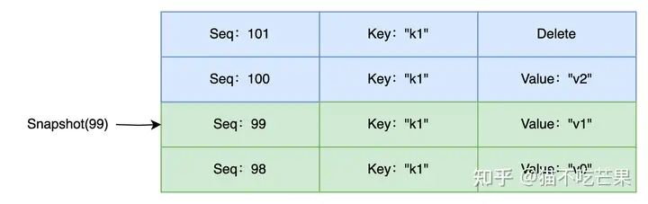
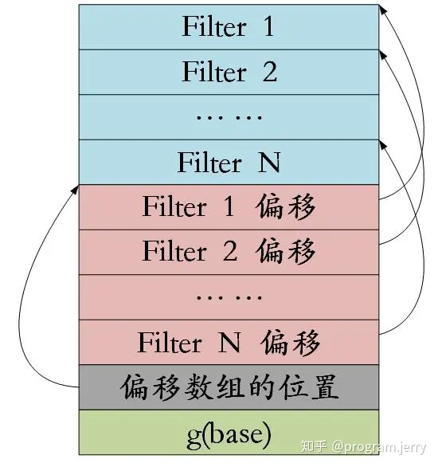

## LSM树简述
### 随机读写与顺序读写
磁盘访问时间：
1. 寻道时间：为读取某个目标扇区的内容，传动臂将磁头定位到目标扇区的磁盘上
2. 旋转延迟：磁头固定到目标扇区后，驱动器等待目标扇区的下一个位旋转到磁头下
3. 传送时间：目标扇区的第一个位位于磁头下，到访问完所有数据花费的时间

相比随机读写，顺序读写可以简单理解为只需要一次寻道时间 + 旋转延迟，然后就是传送时间，对于随机读写，寻道时间和旋转延迟存在多次

### 数据库索引
数据库中常用的索引结构B+树和LSM树
* B+树特点：插入和搜索的效率高，时间复杂度为O(logn)，但是使用B+树作为索引具有明显缺陷，**逻辑上相离很近但物理上相隔很远（链表保存），会导致大量的磁盘随机读写**
* LSM树特点：将B+树在物理上随机读写改为顺序读写，解决B+树的弊端

### 整体架构


* MemTable
MemTable是内存中的数据结构，数据在内存中是有序的，可以通过跳表、红黑树等数据结构实现

* SSTable
Sorted String Table，有序字符串表，LSM树使用SSTable将LSM树持久化到磁盘，SSTable是一种存储键值对的格式，按照key进行排序

* WAL
WAL(writed ahead log)写前日志， 写数据之前将写请求操作日志写到日志结构中，通过操作日志的方式完成写操作，每一个WAL 日志对应一个 memtable的创建，当memtable 转换为 immutable 时，创建新的WAL

* Compaction
当SSTable里面的数据太多，就使用Compation操作将不同的SSTable之间的重叠数据合并

### 写数据
LSM树只执行顺序写操作，同时写Memtable和预写日志WAL，当Memtable满时，需要将Memtable中的数据刷新到磁盘上的SSTable上

### 读数据
由于不同Segment之间存在重复数据，所以SSTable中存储了大量冗余信息，读数据需要从最新的倒着查询，直到找到某个key的记录，最坏情况需要查询所有的SSTable
所以对于读操作而言，可以使用稀疏矩阵或者布隆过滤器来加速查询


### Compaction
随着时间推移，系统将在继续运行时积累更多的Segment文件，这些Segment文件需要清理和维护，防止Segment存储失控
Compaction线程将老的Segment组合成新的Segment
如下图所示，Segment1 和 Segment2 都有一个key为dog的值，较新的段写入最新值，所以段2的值移到段4中


### 删除数据
删除实际遵循与写入数据完全相同的操作，当收到删除请求时，会为该值写入一个墓碑的标记，当Compaction触发时才进行物理删除

## leveldb 具体实现
### leveldb 的实际需求
1. 对写入性能要求高, 而读性能是次要的. 可能很多人对此表示不理解, 认为现实环境中读的次数远多于写的次数. 这是他们对LevelDB所在的层次有所误解. LevelDB是个最底层的存储库, 而大多数读数据应该在上层的cache中获取, 不应该过于依赖LevelDB本身的读操作(虽然其本身有一定程度的cache支持), 另外对于查找不存在的记录确实每次都会访问到LevelDB, 不过通过适当配置的bloom filter可以避免绝大部分磁盘读操作. 而写操作就不一样了, 上层的写操作要频繁地落实到LevelDB上, 否则断电就会丢掉刚写入的数据. 因此可以看出, 在LevelDB这个层次来看, 正常用法是写操作多于读操作的.

2. 数据库虽庞大, 但根据80/20定律, 只有少部分数据会频繁读写. LevelDB的分层就是解决此问题而设计的, 冷热数据很容易分到不同的层次, 位于低层的少部分热数据文件的访问会快很多, 位于高层的大量冷数据大部分时间都在磁盘里静静地躺着, 顺带增量备份也容易实现.

3. 数据写入经常是间歇突发的. 数据库的访问经常是不稳定的, 为了削峰填谷, LevelDB在写入时只做了最有必要的操作就返回了成功, 即顺序附加到log文件并更新内存中的memtable. 当然数据库仅靠这样的操作无法高效访问数据, 所以利用没有数据访问期间的空闲时间, 用后台线程慢慢整理数据. 既让每次操作看起来很快, 也能充分利用空闲的CPU和IO改进整体性能, 符合多核CPU时代的设计理念. 当然整理也分优先级的, 这也是分多层设计的原因之一.

#### 个人理解
1. leveldb 每层level逐级能承受更大的压缩阈值，当一个相同key多次操作，并不会引得多个文件立即合并，而是先处理低层级，再慢慢处理高层级压缩，一定程度上减少写放大
2. leveldb 更多还是面向冷数据存储，level层级越高相关联的数据也访问频率更低，热数据在更高层级，前者查询效率低，后者高，也符合如cache设计的访问
3. 使用分级将数据压缩优化至不同时间处理，也一定程度上优化了多核运行效率

### 基础部分（与LSM树一致）
LevelDB 主要包括MemTable内存数据库和SSTable磁盘数据库两部分
新增、修改、删除数据时会产生一条日志，追加到磁盘WAL中，用于系统崩溃时进行数据还原
随后将操作与数据信息编码成一条记录插入内存的MemTable中，并对插入数据进行排序

### ImmuTable
当MemTable容量达到阈值时转化为ImmuTable，并创建一个新的Immutable用于后续的数据写入，同时后台线程将Immutable中的数据Flush到磁盘的SSTable文件中

Level级别越高该层级的SSTable文件越旧、数据容量越大，Minor Compact过程就是将Immutable MemTable数据写入磁盘，在Level 0生成一个新的SSTable文件

### leveldb架构图总览


### leveldb读取数据
LevelDB中数据可能会存储于MemTable、Immutable MemTable、SSTabel（Level 0~Level n）中，并且由于是追加写的操作，**同一个Key可能同时存储在上述多个结构中**，只是这些Key对应的Value以及操作（增删改）不同。**为了优先读取最新数据，每次数据查询时总是从新文件往旧文件查询**

因此每次读取操作先查询内存数据MemTable和Immutable MemTable，若没查到则继续查找磁盘中的SSTable文件。内存中MemTable和Imutable MemTable是跳表结构，**查找时间复杂度为O(log n)**

而磁盘中第0层的SSTable文件之间可能存在数据重叠的情况，**因此在数据查询时需要遍历Level 0的所有SSTable文件**，为了避免0层文件越来越庞大冗余影响数据读取效率以及磁盘空间利用率，当0层文件容量或数量达到一定阈值后，将通过多路归并的方式将第0层的文件合并为若干个没有重叠且有序的1层文件

以此类推，当某个 Level 中的 SSTable 文件数量或容量达到阈值时，会触发该 Level 文件和下一个 Level 文件的合并操作，这个过程会生成新的SSTable文件删除旧的SSTable文件，这个合并操作叫作Major Compact。**由于合并后Level 1 ～ Level n中文件总是不重叠且有序的，因此对于这几层可以采用二分查找的方式提升文件查询效率**

### leveldb 读
LevelDB中通过快照读的方式避免数据读取期间写操作新增数据的影响，解决数据库事务不可重复读和幻读问题

每次写操作都会有一个递增的唯一序列号（sequence num）进行标识，LevelDB中巧妙的使用了递增序列号的排序特性，每一个序列号即一个LevelDB的数据快照，快照读时会记录当前数据库的最大操作序列号，**在查询过程中大于该序列号的记录均不会被查询出，查询出的是不大于该序列号的最新数据**

**示例**
下图中在序列号为99时发起了一次目标键"k1"的快照读操作，在读操作过程中新增了两个对键"k1"的写操作，根据快照读规则，序列号100、101大于99，对应的记录不会被查出，序列号98数据比99旧也不会被读出，因此读取的是序列号99对应的


#### 流程
1. 若用户传入了快照对象，则取出快照对应的序列号；若用户未传入则基于数据库最大序列号生成一个数据快照
2. 获取数据库最新版本对象，版本对象中记录了当前数据库的文件信息
3. 根据数据快照和目标键创建查询键，用于后续的快照查询，查询键的具体结构将在介绍MemTable结构时进行讲解
4. 开始数据查询，首先查询MemTable中数据，若没命中则继续在Immutable MemTable中查询，若仍未命中到则继续到磁盘数据库中进行查询，由于磁盘数据库由多层SSTable文件组成，数据查询时可能要查询多个SSTable文件才有可能命中数据，若查询时筛选到了多个可能存在目标键的SSTable文件，依次查询这些SSTable文件时若第一个文件中未查询到目标键则会记录该文件信息，标记一次无效查询。
5. 若第4步查询时记录了一个无效查询文件，且该文件无效查询次数已经耗尽，说明该文件不够紧凑有点冗余，可能需要进行文件合并。

### leveldb key布局
#### internal key
user_key | sequence & valueType
sequence & valueType use 8 bytes，sequence use 56 bits and
valueType use 8 bits
#### user key
just the key which user insert to the leveldb
#### memtable search key
internal_key_size | internal key (user_key + sequence + valueType)
internal_key的布局前面增加internal_key 的存储字节数
#### memtable data
internal_key_size | internal key (user_key + sequence + valueType) | value size(32) | value
#### internal key sort
internalkey 的有序性通过option.comparator 来控制
* 先按照user key升序
* 按照 seq 降序
* 按照 type 降序

### leveldb wal解析
leveldb 中wal和memtable是一一对应的，当memtable转化成immutable memtable，并生成新的memtable时，也会生成一个新的wal

* log_write.cc	
将写入的操作日志slice字符串划分成block，具体结构如下
header	CRC (4bytes) | Length (2bytes) | RecordType (1bytes) | Payload（slice片段数据）
该文件代码仅控制block编码组合，具体写入通过WritableFile 对象进行实际写入到磁盘，算是维护一个算法
因环境不同，有多个WritableFile实现类进行实际的文件io写入操作，具体参考env_posix 和 env_window


* WritableFile
WritableFile为一个纯虚类接口，派生类主要实现不同平台io文件写入的支持
对象创建由env.cc提供方法

```cpp
Status NewAppendableFile
```
**以下分析linux下WritableFile**
* env_posix.cc | class PosixWritableFile
对fd写入数据，使用了一个缓冲buffer数组来减少IO写入频率，等到buffer容量满时才进行一次io写入操作

### leveldb SSTable


* Data Block：存储KV数据，其中键为internal key，每个Data Block为4kb
* Filter Block：存储过滤信息（布隆过滤器）用于快速检索SSTable文件中是否存在目标键
* MetaIndex Block：存储Filter Block在文件中的偏移量，长度以及过滤器名称
* Index Block：存储每个Data Block在文件中的偏移量，长度以及最大键信息
* Footer: 存储MetaIndex Block和 Index Block文件中的偏移量和长度，大小固定为48kb

#### Footer layout

* 魔数是为了校验功能

#### Block layout


#### Meta Index Block

* Meta Index Block 这里只有一个KV，key 为 fileter.leveldb.BuiltinBloomFilter2 Value 为一个Filter Handler的编码

#### Filter block


### SStable 元信息
```cpp
struct FileMetaData {
  int refs;
  int allowed_seeks;          // Seeks allowed until compaction
  uint64_t number;
  uint64_t file_size;         // File size in bytes
  InternalKey smallest;       // Smallest internal key served by table
  InternalKey largest;        // Largest internal key served by table
  FileMetaData() : refs(0), allowed_seeks(1 << 30), file_size(0) { }
};
```
FileMetaData数据结构保存了sstable文件的元数据，包括文件的名字number、key的范围、引用次数。
每个sstable文件对应一个FileMetaData，每一层的sstable对应的FileMetaData用std::vecotr保存，定位key在磁盘的哪个sstable文件中需要逐层遍历(level-by-level)

### 版本控制
leveldb的版本控制是用来管理和跟踪数据库的版本变化的机制
为了解决SSTable的读写冲突问题，采用了多版本并发控制的方式
**每次SSTable文件变更都会产生新的版本，每个版本维护了当前版本下的文件信息**
SSTable文件生成后都是只读，通过引用计数控制SSTable文件的删除


#### class version

#### class VersionSet
每次SSTable文件发生变更时都会生成一个新的Version，新的version不会覆盖旧的version，而是添加到版本链versionSet中，**因为可能存在用户使用着旧的version**


### leveldb Cache 
#### LRUCache in_use_双向循环链表


## linux API 补充
### open flags 描述
``int open(const chr *pathname, int flags, mode_t mode)``
* O_RDONLY:     只读方式打开文件
* O_WRONLY:     只写方式打开文件
* O_RWWR：      以可读可写方式打开文件
* O_CREAT:      如果pathname参数指向的文件不存在则创建此文件
* O_DIRECTORY:  如果pathname参数指向的不是一个目录，则open失败
* O_TURNC:      调用open函数打开文件时会将文件原本内容丢弃
* O_APPEND:     从末尾开始写入数据
英文文档参考``man open``

### memcmp
``int memcmp(const void* s1, const void* s2, size_t n)``
* 如果返回值 < 0 表示s1 小于 s2
* 如果返回值 > 0 表示s1 大于 s2
* 如果返回值 = 0 表示s1 等于 s2 (n长度情况下)
返回值是 s1 和 s2 第一个不同的字节差值

### lseek
``off_t lseek(int fd, off_t offset, int whence);``
reposition read/write file offeset 重新定位fd的偏移量
whence类型：
* SEEK_SET: 设置偏移量为文件开始的offset个字节
* SEEK_CUR: 设置偏移量为当前值增加offset个字节
* SEEK_END: 设置偏移量为文件长度加offset个字节

### pread
``ssize_t pread(int fd, void *buf, size_t count, off_t offset);``
read from a file descriptor at a given offset
从一个文件描述以offset偏移量读取count个字节数据


### 头文件目录
* /usr/include
* /usr/local/include


## 陌生单词
* emit          排放，散发（尤指气体、辐射物）；发出
* underlying    底层
* 

## version版本管理
LevelDB使用VersionSet来管理读写流程中的不同version，每一个version包含如图信息
* 当前又多少level，每个level都有哪些文件构成
* version记录level得分用于比较优先级，较高得分的level先合并
* version与version之间的差异由versionEdit描述，包含增加和删除文件信息

正常情况下versionSet中仅有一个版本，但由于读写并发，可能有多个进程读时为老版本的文件，所以需要保留老版本version，等读流程结束后减少其引用计数为0，从versionSet中删除

version之间的先后顺序由双链表来表示，versionSet中的dumpy为链表头节点，采用头插法最先版本为dumpy->prev

version变化的触发时机有：
* MemTable超过阈值，转化为imm，需要进行持久化
* 当前Level超过设定阈值，需要进行合并操作
* 某文件读取次数超过阈值（读文件的累计成本高于合并该文件），需要进行合并操作


### version
version 用于记录某次数据库SSTable文件变更后各层SSTable文件的元信息，包括当前版本下文件合并的基础信息
版本中引用计数refs用于标记该版本是否有用户在使用，如果无用户在使用说明该版本已经过期
这个不活跃的版本将从数据库的版本链中移除，下次文件合并完成后通过RemoveObsoleteFiles进行无效文件移除时，无效版本中存在但是最新版本中不存在文件将会被移除，这种延迟移除文件的方式避免了文件访问与移除事件的冲突。
```cpp
class Version {
  Version* next_; //版本链的下一个版本
  Version* prev_; //版本链的前一个版本
  int refs_; // 版本的引用计数

  // 当前版本下各层SSTable的元信息
  std::vector<FileMetaData*> files_[config::kNumLevels];

  //seek_compaction的基本信息
  FileMetaData* file_to_compact_;
  int file_to_compact_level_;
  //size_compaction的基本信息
  double compaction_score_;
  int compaction_level_;
};
```

**引用计数处理**
```cpp
void Version::Unref() {
  --refs_;
  if (refs_ == 0) {
    delete this; //引用数为0
  }
}

Version::~Version() {
  // 从版本链中移除
  prev_->next_ = next_;
  next_->prev_ = prev_;

  // 版本中所有文件元信息引用计数减1
  for (int level = 0; level < config::kNumLevels; level++) {
    for (size_t i = 0; i < files_[level].size(); i++) {
      FileMetaData* f = files_[level][i];
      assert(f->refs > 0);
      f->refs--;
      if (f->refs <= 0) {
          //过期文件元信息没有任何用户再使用，销毁
          //只是销毁元信息，不是删除对应文件
        delete f; 
      }
    }
  }
}
```

### VersionEdit 
versionEdit 存储增量变化内容，每次文件变动会生成一个当前文件变动的VersionEdit
**version n + version edit = version n + 1**


```cpp
class VersionEdit {
  typedef std::set<std::pair<int, uint64_t>> DeletedFileSet;

  std::string comparator_;
  uint64_t log_number_; //日志文件序号
  uint64_t next_file_number_; //下一个文件序号
  SequenceNumber last_sequence_; //最新操作序号
  //本次文件合并时每层的结束位置
  std::vector<std::pair<int, InternalKey>> compact_pointers_; 
  DeletedFileSet deleted_files_; //已经被合并的文件
  std::vector<std::pair<int, FileMetaData>> new_files_;//新生成的文件
};
```

### VersionSet
每次sstable文件发生变更都会生成一个新的version，新的version不会覆盖旧的version，而是添加到版本链中，这是因为**旧的Version可能仍然有用户在使用**，通过版本链追加实现的多版本并发控制避免了读写事件之间出现竞态，实现了读写分离。

```cpp
class VersionSet {
  Env* const env_;
  const std::string dbname_;
  const Options* const options_;
  TableCache* const table_cache_; //数据库缓存
  const InternalKeyComparator icmp_;
  uint64_t next_file_number_; //下一个文件序号
  uint64_t manifest_file_number_; //manifest文件序号
  uint64_t last_sequence_; //最新操作序号
  uint64_t log_number_; //日志文件序号

  //manifest可写文件与文件写入器
  WritableFile* descriptor_file_;   // 文件顺序写操作类
  log::Writer* descriptor_log_;     // 控制 writableFile 顺序写 block

  Version dummy_versions_;  //双向环形版本链
  Version* current_;  // 当前最新版本

  std::string compact_pointer_[config::kNumLevels];//上次文件合并时每层的结束位置
};
```

### 合并策略

#### Trival Move 优化
* level层的文件个数只有1个
* level层文件与level + 1层文件没有重叠
* level层文件与level + 2层文件重叠部分不超过阈值
将level层文件移动到level + 1 层中

#### Seek Compaction
如果某个文件上发生了多次无效检索，搜索某个key但没找到，即希望对该文件进行压缩
假设检索消耗 10ms，即读写1MB 消耗 10ms，而压缩1MB 文件需要做25MB的I/O，（1.从这层读取1MB数据 2.从下一层读取10-12MB数据 3.写10-12MB数据到下一层）
所以25次检索的代价等价于1MB数据做合并，即一次检索等价于40kb数据合并

文件的元数据有一个allowed_seeks字段，存储就是该文件剩余无效检索的次数
```cpp
f->allowed_seeks = static_cast<int>(f->file_size / 16384U);
if(f->allowed_seeks < 100) f->allowed_seeks = 100;
```
* 每次调用Get，如果检索了该文件，leveldb就会判断是否检索了一个以上的文件，如果是，则减少该文件的allowed_seeks
* 当文件 allowed_seeks 为0，就会触发seek_compaction

#### 压缩计分
leveldb使用计分机制来决定下一次压缩在哪个层进行
```cpp
VersionSet::Finzlize()
```
计分最大层和最大计分会存到当前版本的compaction_level_ 和 compaction_score_ 中

* L0 计分算法
L0级文件数量 / L0级压缩阈值 （config::kL0_CompactionTrigger，默认为 4）
* 其他层计分算法
Li级文件总大小和 / Li 级大小阈值 (大小阈值为 10 ^ i MB)

##### 为什么L0层特殊处理
* 使用更大writer buffer情况下，不会做太多的L0 -> L1 的合并，因为L0 本身的阈值就偏小，writer_buffer 偏大情况下，每次 minor compaction 就需要做一次 L0 -> L1 的合并，开销太大
* L0 层文件每次读的时候都要做归并（因为 key 是有重叠的），因此我们不希望 L0 层有太多文件 

### Major Compaction
* 判断合并类型
如果是compaction_score_ > 1 做size_compaction
如果有文件 allowed_seeks == 0 引起合并，做seek_compaction

* 选择合并初始文件
1. size_compaction
初始文件的最大key 要大于该层上次合并时，所有参与合并文件的最大key
每层上次合并的最大key记录在VersionSet的compact_pointer_字段中
使用的是version_set中的compaction_level_

2. seek_compaction
引起seek_compaction 同样也是allowed_seeks为0的文件，会存入至version_set中的file_to_compact_

* 选择所有参与合并的文件
**总的来说时根据文件的重叠部分不断扩大参与合并的文件范围**


**首先我们重新约定下重叠文件与边界文件的概念：**
重叠文件：InternalKey重叠的文件
边界文件：InternalKey不重叠，但是UserKey重叠的文件

文件挑选时一定要保证compaction_level层的边界文件都被挑选出，因为compaction_level层的文件将合并至compaction_level + 1层，如果边界文件没有全部参与合并，将导致同一个UserKey一部分数据留在compaction_level层一部分合并到了compaction_level + 1层，那么下次数据查询时会优先读取到残留在compaction_level层的旧数据

* GetOverlappingInputs是双方向查询[user_begin, user_end]，而AddBoundaryInputs是单方向查询[largest_key, +∞)
* GetOverlappingInputs方法对0层文件进行了特殊处理，能够挑选出0层的边界文件，对于其他层则只能挑选出重叠文件，AddBoundaryInputs方法能够用于非0层边界文件查询

这是因为1-n层文件总是由上一层文件合并而来，每一层文件合并时会记录合并的文件终止点compact pointer，每一次合并都是从上一次合并的compact pointer开始查询合并文件，而compact pointer都是通过AddBoundaryInputs进行边界文件查询之后计算而来的，这使得compact pointer处的文件肯定不存在user_key重叠也就无需向比compact pointer小的文件方向进行查询，而0层文件是由内存数据转化而来，它们变动频繁且文件彼此重叠，不如1-n层文件的合并过程严谨，因此每次都需要遍历文件进行文件查询。

### 注意事项
#### Slice 和 String赋值
```cpp
leveldb::Slice slice;
if (...) {
  std::string str = ...;
  slice = str;
}
Use(slice);
```
slice 只是浅拷贝指针，所以这里str析构后（出作用域）再使用会导致错误


#### 比较器兼容性
比较器 Name() 方法返回的结果在创建数据库时会被绑定到数据库上，后续每次打开都会进行检查，如果名称改了，对 leveldb::DB::Open 的调用就会失败。因此，当且仅当在新的 key 格式和比较函数与已有的数据库不兼容而且已有数据不再被需要的时候再修改比较器名称。总而言之，一个数据库只能对应一个比较器，而且比较器由名字唯一确定，一旦修改名称或比较器逻辑，数据库的操作逻辑统统会出错，毕竟 leveldb 是一个有序的 KV 存储。

如果非要修改比较逻辑呢？你可以根据预先规划一点一点的演进你的 key 格式，注意，事先的演进规划非常重要。比如，你可以在每个 key 的结尾存储一个版本号（大多数场景，一个字节足矣），当你想要切换到新的 key 格式的时候（比如上面的例子 TwoPartComparator处理的 keys 中），那么需要做的是：

* 保持相同的比较器名称
* 递增新 keys 的版本号
* 修改比较器函数以让其使用版本号来决定如何进行排序

### [基本使用指南](https://zhuanlan.zhihu.com/p/322520485)

### 内存屏障
#### ``memory_order_release`` 
可以理解为 mutex 的 unlock 操作
